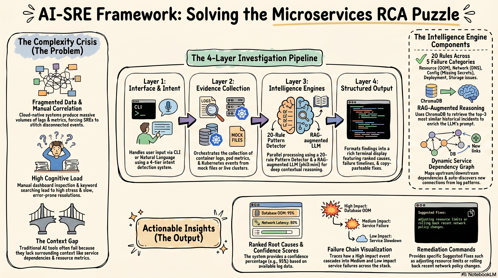

# AI-Assisted SRE RCA Tool
AI-first root cause analysis assistant for Kubernetes microservices incidents.



## What this project does
This project helps SRE teams investigate incidents faster by combining Kubernetes evidence collection with LLM reasoning. Instead of manually stitching together logs, pod events, metrics, and service dependencies, you can run one command and get a structured RCA with confidence, fixes, and historical context. It is designed for dissertation/demo use today and production-style investigation workflows.

## Key features
- Interactive shell entry point via `python ai_sre.py` with command resolution through `core/command_registry.py`.
- Dual analysis modes in `analyse`: RAG mode (default) and baseline mode (`--baseline`), plus side-by-side compare (`--compare`).
- Sliding-window log analysis in `core/window_analyzer.py` (`WindowAnalyzer.analyse`) with confidence-based escalation.
- Incident memory using ChromaDB (`core/rag_engine.py`) and auto-save logic in `core/incident_recorder.py`.
- Kubernetes live RCA pipeline (`core/kubectl_rca_investigator.py`) with staged evidence collection.
- Service topology + blast radius analysis from `services.yaml` via `core/service_graph.py`.
- Log cleaning/noise reduction with `core/log_cleaner.py` and `clean-logs` command.
- Follow-up incident chat mode (`chat`) grounded on `.last_rca.json` context.

## Architecture overview
Primary runtime flow (interactive shell):

1. `ai_sre.py` reads user input.
2. `core.command_registry.resolve()` maps input to a `BaseHandler`.
3. Handlers execute one of two pipelines:
	- **File pipeline**: `LogLoader` → `WindowAnalyzer.analyse()` → `IncidentRecorder.check_and_save()` → `_print_analysis_result()`.
	- **Kubectl pipeline**: `run_kubectl_rca()` → `collect_all_evidence()` → `LLMProvider.generate()` → `IncidentRecorder.check_and_save()` → `_print_analysis_result()`.
4. `.last_rca.json` is saved for `chat` follow-up.

The mindmap (`mindmap.png`) aligns with this design: one command-layer entry, then two investigation branches (file and kubectl), both converging into RCA output and incident memory.

`main.py` also contains a Click-based CLI and legacy pipeline helpers (`run_pipeline`), while `ai_sre.py` is the current external entry point for the command-registry UX.

## Two operating modes

### 1) File mode (default)
- Controlled by `SOURCE_KUBERNETES=false`.
- Loads local logs (`logs/services/<service>.log` or fallback `logs/test.log`).
- Uses `WindowAnalyzer` + incident recording + RAG history.

### 2) Kubectl live mode
- Enable with `SOURCE_KUBERNETES=true`.
- Pulls live cluster evidence with kubectl (pods, events, logs, resources, endpoints, virtual service).
- Uses `analyse <service>` from interactive shell, with optional `--baseline` and `--compare`.

## Tech stack
- Python 3.12+
- `rich` (terminal UI)
- `click` (CLI)
- `requests` (HTTP calls)
- `openai` client path for NVIDIA NIM in `core/llm_provider.py`
- `ollama` (local fallback provider path)
- `chromadb` (vector store)
- `sentence-transformers` (local embedding path when provider is Ollama)
- `numpy`, `pyyaml`

## Quick start

### Prerequisites
- Python 3.12+
- Git
- Optional for live mode: `kubectl` configured to a running cluster
- Optional for local LLM mode: Ollama server

### Installation
```bash
git clone <your-repo-url>
cd sre-rca-tool
python -m venv jarvis
source jarvis/Scripts/activate   # Windows Git Bash
pip install -r requirements.txt
```

### .env setup (from `flags.py` defaults)
Create `.env` in repo root:

```dotenv
SYSTEM_DEBUG=false
SYSTEM_LOG_LEVEL=INFO

UI_SUPPRESS_LOGS=true
UI_RICH_OUTPUT=true
UI_SHOW_TIMESTAMPS=true

LLM_CACHE_ENABLED=true
LLM_CACHE_TTL_SECONDS=3600
LLM_WARMUP_ON_START=true
LLM_KEEP_ALIVE=true
LLM_MAX_TOKENS=2000
LLM_TIMEOUT_SECONDS=300

LLM_PROVIDER=ollama
NVIDIA_API_KEY=
LLM_BASE_URL=https://integrate.api.nvidia.com/v1
LLM_REASONING_MODEL=meta/llama-3.3-70b-instruct
LLM_REASONING_FALLBACK=mistralai/mistral-small-24b-instruct
LLM_EMBEDDING_MODEL=nvidia/nv-embed-v1
LLM_EMBEDDING_FALLBACK=nvidia/llama-nemotron-embed-1b-v2

DEMO_MODE=false
LOG_WINDOW_SIZE=500
LOG_CONFIDENCE_THRESHOLD=60
LOG_FILTER_PATTERNS=health,metrics,ready,live,heartbeat
RAG_NEW_INCIDENT_THRESHOLD=40

OLLAMA_URL=http://localhost:11434/api/generate
OLLAMA_MODEL=phi3:mini

SOURCE_KUBERNETES=false
SOURCE_NAMESPACE=default
SOURCE_LOG_TAIL_LINES=100

RAG_ENABLED=true
RAG_TOP_K=3
RAG_SIMILARITY_THRESHOLD=60

HISTORICAL_LOGS_DIR=logs/historical
CHROMA_DB_PATH=.chromadb
SOURCE_LOG_PATH=logs/test.log
EMBEDDING_MODEL=nvidia/nv-embed-v1
```

### Running file mode
```bash
python ai_sre.py
# then inside prompt:
status
analyse paymentservice
```

### Running kubectl mode
Set in `.env`:
```dotenv
SOURCE_KUBERNETES=true
SOURCE_NAMESPACE=default
```

Then run:
```bash
python ai_sre.py
# then:
analyse paymentservice
analyse paymentservice --baseline
analyse paymentservice --compare
```

## CLI commands (from `REGISTRY` in `core/command_registry.py`)

| Command | Description | Example |
|---|---|---|
| `analyse` / `analyze` | Full RCA investigation | `analyse paymentservice` |
| `analyse <service> --baseline` | LLM-only analysis (no RAG history) | `analyse paymentservice --baseline` |
| `analyse <service> --compare` | Run RAG + baseline and save report | `analyse paymentservice --compare` |
| `status` / `health` | System status dashboard | `status` |
| `compare` | Baseline vs RAG comparison via `main.run_pipeline` | `compare logs/test.log` |
| `watch` / `monitor` | Live watch and periodic RCA | `watch logs/test.log` |
| `chat` | Follow-up Q&A on last RCA context | `chat` |
| `explain` | SRE concept Q&A | `explain what is OOMKilled` |
| `clean` | Clean a log file using `LogCleaner` module | `clean logs/test.log` |
| `clean-logs` | Clean + preview + stats | `clean-logs logs/test.log` |
| `help` | Command help table | `help` |

## Project structure
```text
sre-rca-tool/
├── ai_sre.py                  # Interactive AI-SRE shell (primary entry point)
├── main.py                    # Click CLI + shared pipeline utilities
├── flags.py                   # .env parsing and runtime flags
├── services.yaml              # Service dependency map/schema
├── core/
│   ├── command_registry.py    # Handler registry + interactive command dispatch
│   ├── llm_provider.py        # Unified LLM/embedding provider (NVIDIA/Ollama)
│   ├── llm_analyzer.py        # Baseline/RAG/investigation prompt builders + parsers
│   ├── rag_engine.py          # ChromaDB indexing/retrieval for historical incidents
│   ├── incident_recorder.py   # Similarity check + new incident persistence/embedding
│   ├── window_analyzer.py     # Sliding-window analysis and confidence gate
│   ├── kubectl_client.py      # Kubectl command wrappers
│   ├── kubectl_rca_investigator.py # Live cluster staged evidence collector
│   ├── service_graph.py       # Blast radius/dependency graph loader/updater
│   ├── service_discovery.py   # Namespace/pod matching for unknown services
│   ├── log_loader.py          # File/kubectl/mock log loading
│   ├── log_cleaner.py         # Noise filtering rules
│   ├── log_processor.py       # Log parsing, severity filters, summaries
│   ├── context_builder.py     # LLM-ready context assembly
│   ├── resource_collector.py  # Mock/live resource metrics collector
│   └── logger.py              # Rich-aware logging abstraction
├── evaluation/comparator.py   # Baseline vs RAG comparison formatter/report
├── output/rca_formatter.py    # Rich UI formatter for RCA and investigations
├── logs/                      # test, historical, baseline, and mock evidence
├── docs/                      # dissertation/dev docs and session records
└── reports/                   # compare mode text reports
```

## Certifications and academic context
- M.Tech dissertation project, BITS Pilani WILP (Cloud Computing context).
- Professional upskilling context includes Harness CI/CD certifications.
- Professional upskilling context includes Istio Fundamentals learning/certification track.
- Presentation/dissertation artifacts are maintained in `docs/` and `docs/v3/`.

## License
This repository is released under the MIT License. See `LICENSE`.