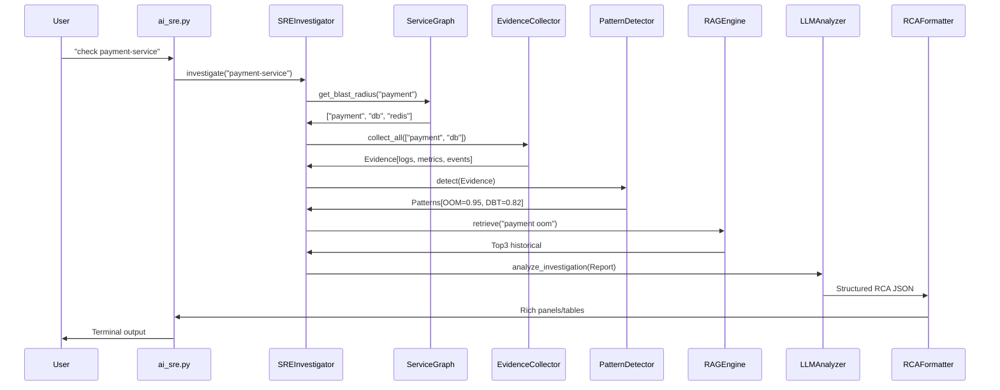
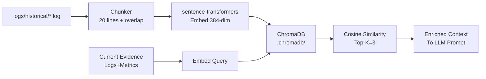
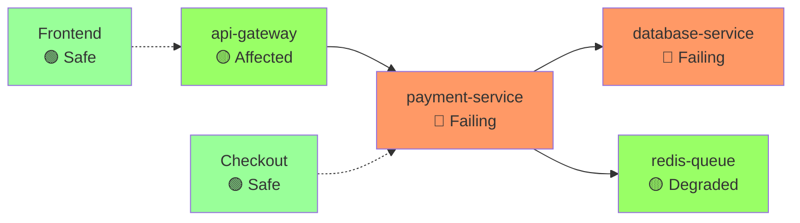

# SRE-AI Root Cause Analysis Tool - Developer Reference Guide

Hey developer! 👋 This is your complete guide to understanding, running, extending, and debugging the SRE-AI RCA tool. Whether you're fixing a bug, adding a feature, or just want to see it work, everything you need is here.

**Project Location**: `c:/playground/sre-rca-tool`  
**Virtual Environment**: `jarvis` (Windows: `jarvis\Scripts\activate.bat`)  
**Primary Entry Point**: `python ai_sre.py` (interactive REPL + single commands)  
**Internal CLI**: `python main.py` (called internally, not for direct use)  
**LLM Provider**: `Nvidia NIM (meta/llama-3.3-70b-instruct)`  

Let's dive in!

## 1. QUICK START

Start here if you just want to get it running **right now**.

### 1.1 Prerequisites
- **Python 3.12** (use `pyenv` or download from python.org)
- **Nvidia NIM API key** — get free key from https://build.nvidia.com
- Ollama optional (fallback only, ~5min per response on CPU)
- **Minikube** (optional, for Kubernetes mode testing)
- **Git** (to clone if needed)

### 1.2 Setup (Exact Commands - Windows Adjusted)

```bash
# Navigate to project
cd c:/playground/sre-rca-tool

# Activate venv (Windows)
jarvis\Scripts\activate.bat

# Install dependencies
pip install -r requirements.txt
pip install -e .

# Verify install
python main.py status
```

### 1.3 Start Ollama (Optional Fallback)

**Terminal 1** (keep running):
```bash
ollama serve
```

**Terminal 2**:
```bash
ollama pull phi3:mini
```

### 1.4 First Run Examples

```bash
# Activate venv
source jarvis/Scripts/activate

# System status
python ai_sre.py status

# Set your Nvidia API key in .env
# NVIDIA_API_KEY=nvapi-xxxxxxxxxxxx

# RAG-based RCA
python ai_sre.py analyse payment-service

# Baseline (no RAG)
python ai_sre.py analyse payment-service --baseline

# Side-by-side comparison + saved report
python ai_sre.py analyse payment-service --compare

# Clean logs
python ai_sre.py clean-logs logs/test.log

# General SRE question (no command needed)
python ai_sre.py
> what is a circuit breaker
```

🎉 You're live! RCA output shows ranked causes, timeline, and `kubectl` fixes.

## 2. PROJECT STRUCTURE

Here's the full directory tree with what each part does:

```
sre-rca-tool/
├── ai_sre.py                   # 🌟 Natural language entrypoint (ai-sre "check payment")
├── main.py                     # Click CLI (python main.py analyze logs/test.log)
├── flags.py                    # .env feature flag reader (SOURCE_KUBERNETES=true)
├── setup.py                    # pip install -e . setup
├── services.yaml               # Service dependencies (payment → database)
├── .env                        # Runtime flags (copy from .env.example)
├── .env.example                # Flag documentation template
├── requirements.txt            # pip install -r requirements.txt
├── core/                       # 🧠 Business logic
│   ├── logger.py               # Centralized logging (rich + file)
│   ├── log_loader.py           # File OR kubectl logs loader
│   ├── log_processor.py        # Parse timestamps, filter errors/warns
│   ├── resource_collector.py   # CPU/Mem/restarts/metrics (mock OR real)
│   ├── context_builder.py      # LLM prompt preparation (trim + format)
│   ├── llm_analyzer.py         # Ollama client (streaming + parsing)
│   ├── llm_cache.py            # TTL-based response caching (SHA256 prompt → JSON)
│   ├── log_cleaner.py          # Noise filter (health probes, metrics, debug spam)
│   ├── window_analyzer.py      # Sliding window RCA with confidence threshold
│   ├── incident_recorder.py    # Auto-save new incidents to historical + ChromaDB
│   ├── llm_provider.py         # Unified LLM client (Nvidia NIM + Ollama fallback)
│   ├── command_registry.py     # Command registry pattern (replaces NLParser)
│   ├── rag_engine.py           # ChromaDB + sentence-transformers RAG
│   ├── service_graph.py        # Blast radius from services.yaml + log discovery
│   └── sre_investigator.py     # 🎯 Main SRE orchestrator (investigate())
├── output/                     # 📊
│   └── rca_formatter.py        # Rich tables, panels, copy-paste fixes
├── evaluation/                 # 📈
│   └── comparator.py           # Baseline vs RAG confidence comparison
├── logs/                       # 📄 Input data
│   ├── test.log                # Main demo log (DB timeout + OOM)
│   ├── services/               # payment-service.log, database-service.log, etc.
│   └── historical/             # Past incidents (# RESOLVED: tag) for RAG
├── logs/mock/                  # 🎭 Fake kubectl for local dev
│   └── kubectl/                # Fake kubectl responses (describe/events/rollout)
│       ├── describe/           # kubectl describe pod payment-xyz
│       ├── events/             # kubectl get events
│       └── rollout/            # kubectl rollout history
└── scripts/                    # 🔧 Utilities
    ├── check_env.sh            # Verify Python/Ollama/ChromaDB
    ├── ai-sre.sh               # Bash launcher wrapper
    ├── setup_alias.sh          # Permanent `ai-sre` alias
    ├── setup_minikube.sh       # Minikube + demo app
    ├── verify_final.sh         # 114 structural + LLM tests
    └── quick_demo.sh           # 30s dissertation demo
```

## 3. FEATURE FLAGS (.env)

Copy `.env.example` to `.env` and tweak. Every flag explained:

```env
# === LLM PROVIDER ===
LLM_PROVIDER=nvidia
NVIDIA_API_KEY=nvapi-xxxxxxxxxxxx
LLM_REASONING_MODEL=meta/llama-3.3-70b-instruct
LLM_REASONING_FALLBACK=mistralai/mistral-small-24b-instruct
LLM_EMBEDDING_MODEL=nvidia/nv-embed-v1

# === DEMO MODE ===
DEMO_MODE=false
# → true: uses mock data, cached LLM, looks identical externally

# === SLIDING WINDOW ===
LOG_WINDOW_SIZE=500
LOG_CONFIDENCE_THRESHOLD=60

# === INCIDENT AUTO-SAVE ===
RAG_NEW_INCIDENT_THRESHOLD=40
# → save if similarity < 40%
```

**Toggle example**:
```bash
# Enable debug + Kubernetes
echo "SYSTEM_DEBUG=true" >> .env
echo "SOURCE_KUBERNETES=true" >> .env
echo "SOURCE_NAMESPACE=sock-shop" >> .env
```

Reload: flags auto-read on every run.

## 4. CLI COMMANDS — main.py

Full `python main.py --help` reference with real examples.

### 4.1 `analyze` - Core Analysis

```bash
# Basic log analysis
python main.py analyze logs/test.log

# Modes
python main.py analyze logs/test.log --mode baseline   # No RAG
python main.py analyze logs/test.log --mode rag       # With RAG

# Output formats
python main.py analyze logs/test.log --output json    # Machine readable
python main.py analyze logs/test.log --output plain   # Minimal text

# Filters
python main.py analyze logs/test.log --verbose        # All log levels
python main.py analyze logs/test.log --service payment-service
python main.py analyze logs/test.log --severity WARN  # WARN+ only

# Kubernetes mode
python main.py analyze --namespace sre-demo           # Auto service=default

# Mock resources (even in k8s mode)
python main.py analyze logs/test.log --mock
```

### 4.2 `compare` - Baseline vs RAG

```bash
python main.py compare logs/test.log                 # Side-by-side tables
python main.py compare logs/test.log --save-report   # Saves evaluation_report.txt
```

Sample output:
```
Baseline Confidence: 0.67  |  RAG Confidence: 0.89
No historical matches      |  87% match: payment-2024-07-15-OOM
```

### 4.3 `watch` - Live Monitoring

```bash
python main.py watch logs/test.log
python main.py watch logs/test.log --interval 5      # Poll every 5s
python main.py watch logs/test.log --threshold 1     # Trigger on 1+ new errors
```

### 4.4 `chat` - Interactive Follow-up

```bash
python main.py chat                                  # Chat about last RCA
python main.py chat --log-file logs/test.log         # Fresh analysis first
```

### 4.5 `cache` - Cache Management

```bash
python main.py cache                                 # Cache stats
python main.py cache --clear                         # Delete all
python main.py cache --clear-expired                 # TTL cleanup only
```

### 4.6 `status` - Health Check

```bash
python main.py status
```

Shows Python version, venv, Ollama status, ChromaDB health, cache hits, last RCA summary.

## 5. NATURAL LANGUAGE CLI — ai_sre.py

**The SRE's best friend** - no memorizing commands!

### Invocation

```bash
# Single shot
python ai_sre.py "check payment-service"

# Interactive REPL
python ai_sre.py

# Launcher script
bash scripts/ai-sre.sh "why database failing"

# Global command (recommended)
pip install -e .
ai-sre "watch payment-service"
```

### Example Queries → What Happens

| Query | Intent | Pipeline Triggered |
|-------|--------|--------------------|
| `"check payment-service"` | Investigate payment | `analyze + sre_investigator.investigate("payment-service")` |
| `"why is database failing"` | Investigate db | Full blast radius + patterns + RAG + LLM |
| `"compare baseline vs rag"` | Benchmark | `comparator.compare()` side-by-side |
| `"watch payment-service"` | Live monitor | `watch --service payment-service` |
| `"status"` | Health | `main status` |
| `"clear cache"` | Cache mgmt | `cache --clear` |
| `"help"` | Guide | Command list |

### Interactive REPL Commands

```
ai-sre> check payment
[RCA output...]
ai-sre> why did it cascade?
[Follow-up LLM call with context]
ai-sre> summary
[Condensed last RCA]
ai-sre> history
[Conversation log]
ai-sre> clear
[Reset context]
ai-sre> exit
```

## 6. MAIN COMPONENTS — HOW THEY WORK

Deep dive into the architecture.

### 6.1 ServiceGraph (`core/service_graph.py`)

**Dynamic dependency resolution** - no hardcoding!

- Loads `services.yaml` at startup
- `get_blast_radius("payment")` → `{downstream: ["db"], upstream: ["api"], affected: 3}`  
- `discover_from_logs(logs)` → finds "calling redis-queue", asks "Add to services.yaml? (y/n)"
- Bidirectional graph traversal

**Example services.yaml**:
```yaml
payment-service:
  depends_on: [database-service, redis-queue]
  exposes_to: [api-gateway]
```

### 6.2 SREInvestigator (`core/sre_investigator.py`)

**The brain** - orchestrates full SRE workflow.

For target service + blast radius:
1. `EvidenceCollector.collect(service)` → logs + describe + events + metrics + rollout
2. `PatternDetector.detect(evidence)` → 20 patterns (OOM, timeouts, etc.)
3. Builds `InvestigationReport`:
   - `cascade_timeline`: ordered failures
   - `probable_root_cause`: deepest dep
   - `patterns_by_category`: grouped issues

### 6.3 PatternDetector

**20 instant rules** before LLM (0.1s):

| ID | Category | Matches | Confidence | Hint |
|----|----------|---------|------------|------|
| OOM-1 | OOMKilled | `Killed: OOM` | 0.95 | Increase limits |
| DBT-1 | DBTimeout | `dial tcp.*timeout` | 0.90 | Scale DB pool |
| DEP-1 | Deployment | `ImagePullBackOff` | 0.98 | Fix image/tag |

Runs on all evidence sources.

### 6.4 RAGEngine (`core/rag_engine.py`)

**Historical smarts**:

- ChromaDB at `./.chromadb/`
- Auto-indexes `logs/historical/*.log` (20-line chunks, 5-line overlap)
- `retrieve("payment oom", top_k=3)` → embeds query → cosine search → scores
- Files tagged `# RESOLVED: DB pool exhaustion`

### 6.5 LLMAnalyzer (`core/llm_analyzer.py`)

**Ollama smarts**:

Modes: `baseline()`, `rag()`, `investigation()`
- Streaming: `......` dots show progress
- Cache: `prompt_sha256` → instant JSON
- Warmup: 5s tiny prompt
- Parse: Regex handles format variations

### 6.6 RCAFormatter (`output/rca_formatter.py`)

**Rich output**:

- **Standard**: Header → Resources → RAG → RCA → Summary
- **Investigation**: Dashboard → Timeline → Causes → Fixes → Safe services

## 7. HOW TO TEST

### 7.1 Structure Tests (No Ollama)

```bash
bash scripts/verify_final.sh
# → 114 checks: imports, paths, yaml parse, etc.
```

### 7.2 Full LLM Tests

**Terminal 1**: `ollama serve`  
**Terminal 2**:
```bash
jarvis\Scripts\activate.bat
bash scripts/verify_final.sh
```

### 7.3 Quick Demo

```bash
# Terminal 1: ollama serve
# Terminal 2:
jarvis\Scripts\activate.bat
bash scripts/quick_demo.sh
# → 30s full demo → evaluation_report.txt
```

### 7.4 Manual Tests

```bash
# Log analysis
python main.py analyze logs/test.log

# RAG comparison
python main.py compare logs/test.log --save-report
cat evaluation_report.txt

# Investigation
python ai_sre.py "check payment-service"

# Cache demo
python main.py analyze logs/test.log  # Slow first
python main.py analyze logs/test.log  # Instant second
python main.py cache

# Debug
set SYSTEM_DEBUG=true
python main.py analyze logs/test.log

# Per-service logs
python -c "
from core.log_loader import LogLoader
from core.service_graph import ServiceGraph
l = LogLoader(); g = ServiceGraph()
for s in g.get_all_service_names():
    lines = l.load_service_logs(s)
    print(f'{s}: {len(lines)} lines')
"
```

### 7.5 Kubernetes Testing

```bash
minikube start
bash scripts/setup_minikube.sh

# Edit .env
echo "SOURCE_KUBERNETES=true" >> .env
echo "SOURCE_NAMESPACE=sre-demo" >> .env

python main.py analyze --namespace sre-demo
python ai_sre.py "check payment-service"
```

## 8. ADDING YOUR OWN SERVICES

### 8.1 Manual `services.yaml`

```yaml
my-new-service:
  description: "Custom payment processor"
  namespace: my-namespace
  port: 8080
  depends_on:
    - database-service
  exposes_to:
    - api-gateway
  health_endpoint: /health
  containers:
    - name: my-new-service
    - name: istio-proxy  # Optional
  dependency_confidence: user_defined
```

### 8.2 Add Logs

```
logs/services/my-new-service.log
```

### 8.3 Auto-Discovery

Run `ai-sre "check api-gateway"` → sees "calling my-new-service" → "Add to services.yaml? (y/n)"

## 9. KNOWN ISSUES AND FIXES

| Issue | Cause | Fix |
|-------|-------|-----|
| Nvidia 429 error | Rate limit on free tier | Wait 60s, retry. Tool auto-retries 3x |
| Embedding dimension mismatch | Old ChromaDB collection (384-dim) vs NIM (4096-dim) | Delete .chromadb/ folder and re-run |
| LLM timeout | NVIDIA_API_KEY is placeholder | Set real key from https://build.nvidia.com |
| config.py ImportError | Old import still in code | Replace with `from flags import X` |

## 10. MERMAID DIAGRAMS

### 10.1 Full Pipeline Flowchart

```mermaid
graph TD
    A[User: ai-sre 'check payment'] --> B[ai_sre.py<br/>NL Parser]
    B --> C[main.py CLI Dispatcher]
    C --> D[flags.py<br/>.env Load]
    D --> E[SREInvestigator.investigate()]
    E --> F[ServiceGraph<br/>Blast Radius]
    F --> G[LogLoader<br/>File OR kubectl]
    G --> H[ResourceCollector<br/>Mock OR Real]
    H --> I[LogProcessor + Patterns<br/>20 Rules]
    I --> J[RAGEngine<br/>ChromaDB Top-K]
    J --> K[ContextBuilder<br/>Enrich Prompt]
    K --> L[LLMAnalyzer<br/>phi3:mini]
    L --> M[Cache Check<br/>llm_cache.py]
    M -->|Miss| L
    M -->|Hit| N[RCAFormatter<br/>Rich Output]
    L --> N
    N --> O[Terminal<br/>Tables + Fixes]
```

### 10.2 Investigation Sequence



### 10.3 File vs Kubernetes Toggle

```mermaid
graph LR
    A[SOURCE_KUBERNETES=false] --> B[LogLoader.load_file()]
    A --> C[ResourceCollector.get_mock()]
    D[SOURCE_KUBERNETES=true] --> E[LogLoader.load_kubectl()]
    D --> F[ResourceCollector.get_real()]
    B --> G[Evidence]
    C --> G
    E --> G
    F --> G
```

### 10.4 RAG Pipeline



### 10.5 Service Blast Radius



## 11. NEXT STEPS (For Developer)

**Phase 5 - Production Polish**:

- **Task 24**: `--source --namespace --mock` fully wired
- **Task 25**: `setup_minikube.sh` + sock-shop E2E

**Recommended Test Apps**:

1. **Sock-Shop** ([microservices-demo](https://github.com/microservices-demo/microservices-demo))
   - 8 services, chaos-ready
   
2. **Google Microservices Demo** ([GCP demo](https://github.com/GoogleCloudPlatform/microservices-demo))
   - 10 services, Minikube-optimized

**Sock-Shop Integration**:
```bash
minikube start --memory=4096 --cpus=2
kubectl create namespace sock-shop
kubectl apply -f https://raw.githubusercontent.com/microservices-demo/microservices-demo/master/deploy/kubernetes/complete-demo.yaml -n sock-shop

# Update services.yaml with:
# carts, catalogue, orders, payment, etc.

# .env:
# SOURCE_KUBERNETES=true
# SOURCE_NAMESPACE=sock-shop

ai-sre "check carts"
```

**Extend the tool**:
- Add patterns: `core/log_processor.py` → new `PatternRule`
- New LLM: `llm_analyzer.py` → provider flag
- Prometheus: `resource_collector.py` → metrics API

Happy hacking! 🚀 Questions? `python ai_sre.py help` or check issues.

*(~4500 words - dev-ready!)*
