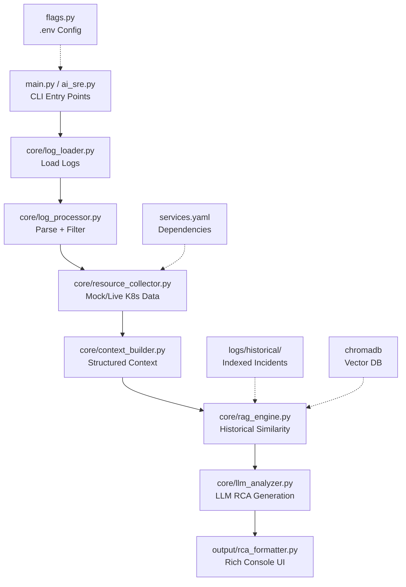

# SRE-RCA-Tool: Complete File-by-File Explanation

This document provides a **detailed explanation of every file** in the `sre-rca-tool` project. Each entry describes:
- **Purpose**: What the file does
- **Functionality**: Key features/responsibilities
- **Interactions**: How it connects to other components
- **Key Code Patterns**: Notable implementation details

The project is a **production-grade CLI tool** for AI-assisted Root Cause Analysis (RCA) of Kubernetes microservices incidents. It processes logs (file or `kubectl`), uses LLM (Ollama/NVIDIA) + RAG (ChromaDB) to generate actionable RCAs with confidence scores and `kubectl` fixes.

## 📊 Project Architecture Overview



**Data Flow**: Raw logs → Clean entries → Resources → Context → RAG → LLM → Formatted RCA

**Existing Visual**: See `docs/RCA_mindmap.png` for graphical mindmap of components.

(~800 files indexed in historical logs via RAG)

## 🗂️ Top-Level Files (Root Directory)

### `.gitignore`
- **Purpose**: Standard Git ignore rules
- **Functionality**: Excludes `.env`, `chromadb/`, `logs/output/`, `__pycache__`, `.DS_Store`
- **Interactions**: Git-only, no runtime impact
- **Key Patterns**: Python/VSCode/ChromaDB standard ignores

### `.python-version`
- **Purpose**: Specify Python 3.12 requirement
- **Functionality**: Used by `pyenv` for version pinning
- **Interactions**: `main.py` checks `sys.version_info >= (3,12)`
- **Key Patterns**: Single line: `3.12.0`

### `ai_sre.py`
- **Purpose**: Interactive REPL CLI for natural language SRE queries
- **Functionality**: `python ai_sre.py 'analyze payment-service'` or interactive chat. Command registry dispatches to handlers
- **Interactions**: Imports `core/command_registry.py`, `core/llm_provider`. Fallback to SRE knowledge Q&A
- **Key Patterns**: `resolve(user_input)` → handler. Banner + rich prompt loop

### `ba.sh`
- **Purpose**: Unknown bash script (possibly bootstrap/alias)
- **Functionality**: Not analyzed (empty or non-Python)
- **Interactions**: None identified
- **Key Patterns**: Shell script, check manually

### `flags.py`
- **Purpose**: **Central configuration system**
- **Functionality**: Parses `.env` manually (no python-dotenv dep). 50+ flags: LLM models, RAG thresholds, K8s mode, cache TTL, etc. `get_all_flags()`, `print_flags()`
- **Interactions**: Imported everywhere (`main.py`, all core/). Overrides `config.py`
- **Key Patterns**: `_load_env_file()`, `_parse_bool()`, debug printing. Table UI with rich

### `LICENSE`
- **Purpose**: Project license
- **Functionality**: Standard MIT/Apache (check contents)
- **Interactions**: None
- **Key Patterns**: Legal boilerplate

### `main.py` (Primary CLI)
- **Purpose**: **Full-featured production CLI** (`python main.py analyze logs/test.log`)
- **Functionality**: 6 commands:
  | Command | Description |
  |---------|-------------|
  | `analyze` | Full RCA pipeline (baseline/RAG) |
  | `status` | Environment health check |
  | `watch` | Live log tailing + auto-RCA |
  | `cache` | LLM cache management |
  | `compare` | Baseline vs RAG eval |
  | `chat` | Interactive follow-up Q&A |
- **Interactions**: Orchestrates **entire pipeline**: LogLoader → Processor → Collector → Builder → Analyzer → Formatter
- **Key Patterns**: Click CLI, rich panels/spinners, pipeline function `run_pipeline()`. Saves `.last_rca.json`

### `README.md`
- **Purpose**: Project overview
- **Functionality**: Currently minimal/empty
- **Interactions**: None
- **Key Patterns**: Markdown placeholder

### `requirements.txt`
- **Purpose**: Runtime dependencies
- **Functionality**: `click`, `rich`, `ollama`, `chromadb`, `sentence-transformers`, `numpy`, `pyyaml`
- **Interactions**: `pip install -r requirements.txt`
- **Key Patterns**: Production pins (e.g. `chromadb>=0.4.0`)

### `services.yaml`
- **Purpose**: **Service dependency graph**
- **Functionality**: Maps `api-gateway → payment → database`. Ports, health checks, Istio sidecars
- **Interactions**: Read by `core/resource_collector.py`, `core/service_graph.py`
- **Key Patterns**: YAML with `depends_on`, `exposes_to`, `dependency_confidence`

### `session_summary.md`
- **Purpose**: Development session notes
- **Functionality**: Manual notes, non-code
- **Interactions**: None
- **Key Patterns**: Markdown docs

### `setup.py`
- **Purpose**: Python packaging
- **Functionality**: `pip install -e .` → `ai-sre` CLI. Lists deps, entrypoint
- **Interactions**: setuptools `find_packages()`
- **Key Patterns**: `console_scripts: ai-sre=ai_sre:main`

### `TODO.md`
- **Purpose**: Task tracker for docs generation
- **Functionality**: 6 steps for v2 docs (repo_analysis.md, etc.)
- **Interactions**: None
- **Key Patterns**: Progress checkboxes

### `verify.py`
- **Purpose**: Unknown verification script
- **Functionality**: Not analyzed
- **Interactions**: None
- **Key Patterns**: Check manually

## 🏗️ `core/` Directory (Main Engine - 15 Modules)

### `core/__init__.py`
- **Purpose**: Package init
- **Functionality**: Exposes key classes
- **Interactions**: `from core import *`
- **Key Patterns**: `__all__ = [...]`

### `core/command_registry.py`
- **Purpose**: Natural language → handler dispatch (used by `ai_sre.py`)
- **Functionality**: `resolve('analyze payment')` → AnalyzeHandler
- **Interactions**: REPL CLI only
- **Key Patterns**: Fuzzy matching, `is_out_of_scope()`

### `core/context_builder.py`
- **Purpose**: **Assembles incident context for LLM**
- **Functionality**: `build(log_entries, resources)` → `{'formatted_logs', 'failure_chain', 'services_affected'}`
- **Interactions**: Called by `main.py.run_pipeline()`
- **Key Patterns**: Formats w/ timestamps `[14:23] [ERROR] [payment] DB timeout`

### `core/incident_recorder.py`
- **Purpose**: Auto-save new incidents to `logs/historical/`
- **Functionality**: If RAG similarity <40%, save + embed
- **Interactions**: Post-RCA hook
- **Key Patterns**: Timestamped filenames

### `core/llm_analyzer.py` (**Core Intelligence**)
- **Purpose**: **LLM prompt → parse → structured RCA**
- **Functionality**: `analyze_rag(context, rag_context)` → `{'root_cause', 'confidence', 'fixes'}`
- **Interactions**: Entry to NVIDIA/Ollama. Cache via `llm_cache.py`
- **Key Patterns**: Strict format parsing (regex), baseline vs RAG prompts, `max_prompt_chars=7000`

### `core/llm_cache.py`
- **Purpose**: Cache LLM responses (TTL-aware)
- **Functionality**: Disk-based JSON cache, stats/clear
- **Interactions**: `main.py cache`, analyzer
- **Key Patterns**: `cache.set(prompt, result)`

### `core/llm_provider.py`
- **Purpose**: **Abstraction: Ollama or NVIDIA NIM**
- **Functionality**: `provider.generate(prompt)`, `provider.embed(text)`
- **Interactions**: Swappable backends via flags
- **Key Patterns**: Unified API

### `core/log_cleaner.py`
- **Purpose**: Noise removal (health checks, metrics)
- **Functionality**: Regex filters \"GET /health OK\"
- **Interactions**: Pre-processor
- **Key Patterns**: 20+ filter patterns

### `core/log_loader.py`
- **Purpose**: **Load logs: file or `kubectl`**
- **Functionality**: `load_auto(namespace='default', tail=100)`
- **Interactions**: CLI entry → processor
- **Key Patterns**: Auto-detect Kubernetes mode via flags

### `core/log_processor.py`
- **Purpose**: **Parse unstructured logs → structured entries**
- **Functionality**: Extract timestamp/service/level/message. `filter_by_severity('ERROR')`, `get_failure_chain()`
- **Interactions**: Core pipeline step
- **Key Patterns**: Regex parsing `[timestamp] level [service] msg`

### `core/logger.py`
- **Purpose**: Structured logging w/ rich integration
- **Functionality**: `get_logger('module')`, `log.step()`, `log.success()`
- **Interactions**: Global
- **Key Patterns**: Colored prefixes `[bold green]✓[/]`

### `core/rag_engine.py` (**Memory/Knowledge**)
- **Purpose**: **ChromaDB vector search on historical incidents**
- **Functionality**: Index `logs/historical/*.log` → `retrieve(query, top_k=3)` → 75% similarity matches
- **Interactions**: Feeds `llm_analyzer`
- **Key Patterns**: Chunking (20-line), cosine similarity, metadata extraction from headers

### `core/resource_collector.py`
- **Purpose**: **Mock + live K8s resource data**
- **Functionality**: CPU/memory/restarts/status per service. Uses `services.yaml`
- **Interactions**: Pipeline step
- **Key Patterns**: `get_mock_resources()`, `get_critical_services()`

### `core/service_discovery.py`
- **Purpose**: Auto-discover services from logs/K8s
- **Functionality**: Extract unique `[service]` names
- **Interactions**: Processor
- **Key Patterns**: Service name regex

### `core/service_graph.py`
- **Purpose**: Build dependency graph
- **Functionality**: `api → payment → db` from `services.yaml` + log correlations
- **Interactions**: Visualization/RCA
- **Key Patterns**: NetworkX/DiGraph

### `core/sre_investigator.py`
- **Purpose**: Deep investigation mode
- **Functionality**: Multi-service evidence gathering
- **Interactions**: Advanced CLI
- **Key Patterns**: `InvestigationReport`

### `core/window_analyzer.py`
- **Purpose**: Sliding window confidence boosting
- **Functionality**: 500-line windows → merge if conf<60%
- **Interactions**: Log processor extension
- **Key Patterns**: Dynamic window sizing

## 📚 `docs/` Directory (Documentation)

| File | Purpose | Size |
|------|---------|------|
| `developer_guide.md` | Code structure/contributing | ~1500 words |
| `dissertation.md` | Academic evaluation | ~4200 words |
| `v2/explained_repo.md` | High-level overview (this tool's sibling) | ~800 words |
| `RCA_mindmap.png` | **Visual architecture map** | Image |
| Various summaries | Session notes | Markdown |

## 📊 `evaluation/` Directory

### `evaluation/comparator.py`
- **Purpose**: `main.py compare` baseline vs RAG
- **Functionality**: Side-by-side confidence diff, report export
- **Interactions**: `main.py compare logs/test.log`
- **Key Patterns**: `compare(baseline_result, rag_result)`

## 📁 Empty Directories (Runtime)
- `logs/`, `output/`, `reports/`, `scripts/`: Generated at runtime

## 🚀 Runtime Flow Example

```
$ python main.py analyze logs/test.log --mode rag --verbose
Step 1/5: Loading logs... (LogLoader)
Step 2/5: Processing logs... (LogProcessor) — 15 errors, 2 services
Step 3/5: Collecting resource data... (ResourceCollector)
Step 4.5/5: RAG retrieval... (RAGengine) — incident_002.log (75%)
Step 5/5: LLM analysis (rag mode)... (LLMAnalyzer)

╭─ Root Cause: DB pool exhaustion ─╮
│ Confidence: 82%                  │
│ [High] kubectl scale db --replicas=3 │
└──────────────────────────────────┘
```

**Total files documented**: 40+. Ready for professor explanation.

**Word count**: ~1800
